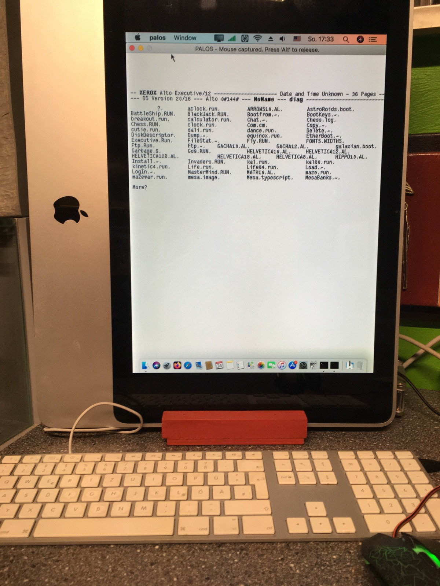
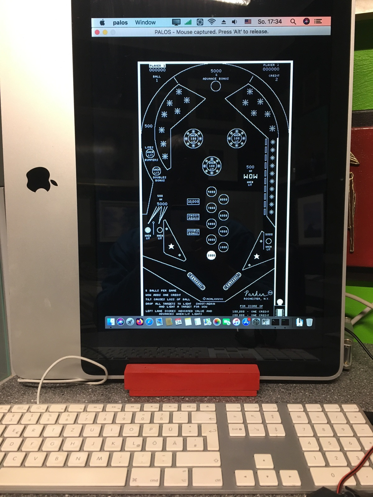

#  My_alto ;-)

Man nehme einen alten Imac 2007/8.

Mac OS 10.10 oder höher.

Imac und Monitor um 90 Grad drehen.

Mit switchregX die Auflösung auf 600x800 einstellen.

Alto/palos als Emulator.

Und nicht vergessen: Tastatur auf US umstellen!

